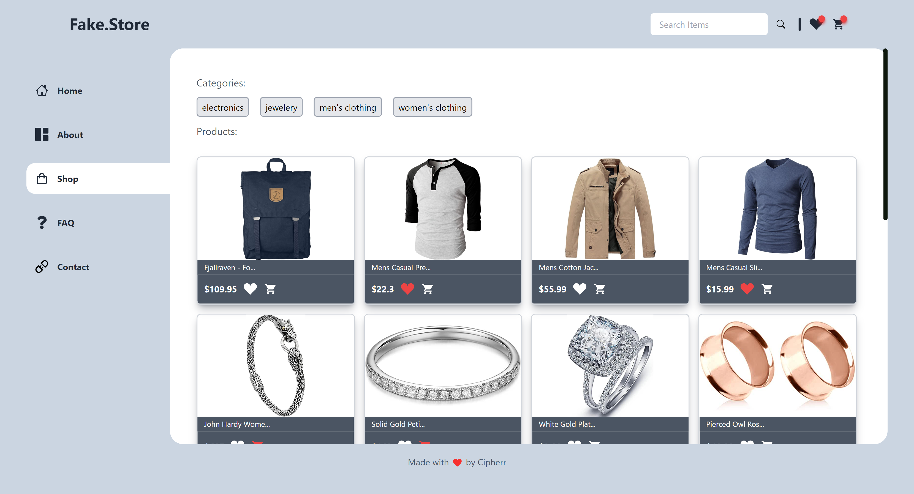
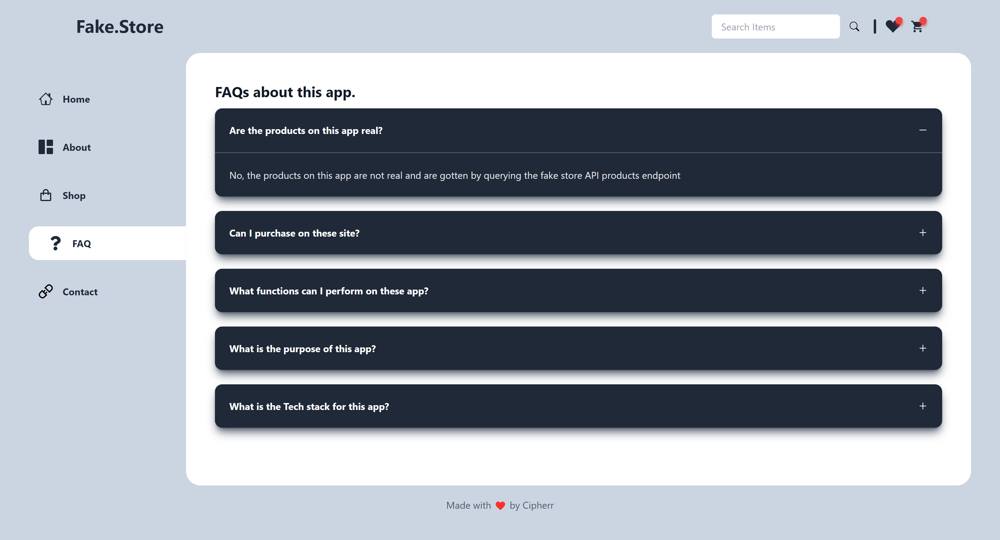

## Redux Ecommerce Application
- Live Demo: [Fake store](https://redux-fakestore.netlify.app/)

Built with React and Redux Toolkit this is a frontend project that implements the basic function an E-commerce application, the logic of adding to cart, to wishilist and all the basic functions you get on an e-commerce application.

Feel free to clone the repo and give feedback.

You can reach out to me here:

LinkedIn: [Afolabi Olajide](https://www.linkedin.com/in/afolabi-olajide)

Twitter: [Officialcipherr](https://www.twitter.com/officialcipherr)
